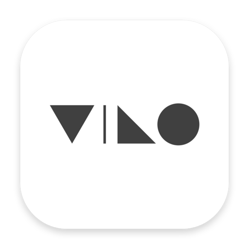
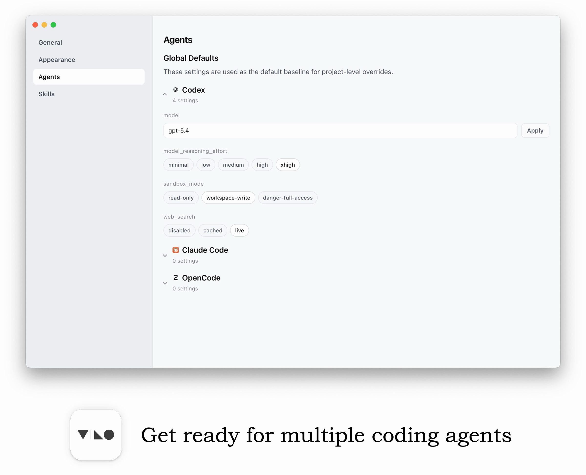

  

<em>Less IDE, More Vibe.</em>

<em>A minimal workbench for vibe coding.</em>

  

# Vibo

Vibo 是一个面向更轻、更安静、更顺手的 agent 编程体验而设计的极简工作台。丢下沉重的 IDE，拥抱极简体验。

Vibo 以终端为核心，只在周围补上刚刚好的功能：更清晰的项目入口、更顺的会话恢复、更轻的文件上下文，以及更适合 `Codex / OpenCode / Claude Code / Shell` 的工作表面。

## 你可以在 Vibo 里做什么

- 从项目入口快速开始。
  打开本地目录或 SSH 远程项目，进入 Project Home，然后直接开始工作。
- 不再靠翻终端历史来恢复 agent 会话。
  以项目为单位重新进入 Codex、OpenCode 和 Claude Code，让上下文恢复更直接。
- 让一个窗口只服务一个项目。
  标签、文件、会话和设置都归属于同一个项目，整个工作流会更安静，也更不容易散。
- 用一个轻量 Hub 替代沉重复杂的侧边栏体系。
  浏览文件、预览图片、快速改文本、明确保存，同时始终离终端很近。
- 在工作流里保留项目上下文。
  查看只读 Git 历史、打开 diff、回看最近项目活动，不必频繁跳出当前节奏。
- 让远程项目拥有和本地一致的体验。
  SSH 项目遵循和本地项目同一套路径，远程工作不再像外挂式终端能力。
- 为每个项目设定自己的默认 agent。
  在项目级配置 preferred agent、skills 和 overrides，但不会演变成一套过度管理化的设置系统。

## 参与贡献与许可证

欢迎参与贡献。如果你想一起打磨 Vibo，请先阅读 [CONTRIBUTING.md](./CONTRIBUTING.md)。

Vibo 使用 [MIT License](./LICENSE) 开源。
